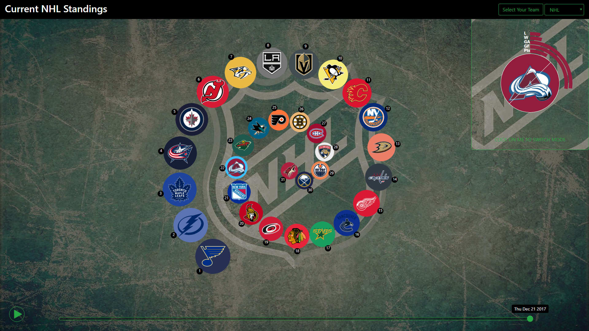

# Process Book

## Project Propsoal

We want to build a visualization that overviews the current state of the NHL championship while giving the opportunity to the viewer to compare stats between two teams. We will include a time slider that let's the user interactively change the date to transform the data that is fed to the visualization.

For the overview, we will order and scale the logos of each team with respect to their current number of points in the league. We want to show the ordered logos following a certain shape, like a spiral or eventually a shape related to hockey.

To compare two team, the user will have to click on one logo, then that logo will be highlighted and when the user clicks on another logo, the two logo are superposed (one half in the right with one half on the left) and re-scaled, and circular barplots around the logos appear to compare their statistics.

### Motivation:
It would be interesting to make a viz that can give a good picture of how the NHL is evolving while being interactive and giving the user more in depth comparison of his favorite team if he wants to.

### Target Audience:
We target mostly NHL fans but no specific knowledge is required to understand the overview visualization. The comparison might require the viewer to know about hockey a bit.

### Related Work and Inspiration:
We wanted to find a nice way to get a global picture of a championship and we found the NHL to be a good fit to try.

### What am I trying to show:
The goal is really to show how the championship is evolving over time.

## User interaction evolution

At first we went with a carousel selector with a pop-up to let the user select his favorite team.

But the selection of the team was too tedious and slow so we added a grid layout to select the team. Since there are 31 teams, we also added a random selector to have an nice even grid of 4 by 8.

We also implemented a slider that let's the user easily change the date of the championship.

TODO add image slider

We added a dropdown to select either the conference or the division of the currently selected team since this an important feature of the NHL. This let's the user see a ranking of the team that actually play against each other in the league since the team only play against other teams in their conference.

By clicking on the top right panel, the user can switch between two display modes. This let's the user focus either on more detailled stats or on the general ranking.
The final version of the panel is blinking until the user clicks on hit once such that the user undertstand the purpose of the panel and how to interact with it. Here we show a screenshot of the panel in transition!

## Layout choice evolution

First we thought about having three separated parts of the page dedicated to display the data and the user choices.
One part was the overall state of the competition and the two other parts were to compare the selected team's statistics.

But we were not satisfied with this design so we decided to change for a "two sided" page where the user, by hovering on either the right or left side of the page, slides the window and can focus on the general ranking or the selected team's statistics. This gives us the possibility to show within a single circle the stats and logo of both team at the same time.

The next screenshot gives a look at what this layout looked like:

But as you can see this sliding window doesn't bring a lot of value to the visualization.

We sketched a diffrent layout with a "wheel" to select and show the state of the championship while showing the detailed stats:

But we never implemented this layout as we find a different idea that preserves the original wish of having a specific shape represent the state of the league.
We went for two rectangular frames instead of sliding windows such that the content in the frame can be observed wheter it is minized or not:

At this point we have a layout that fits our needs and it was a good time for a first beautify:

Of course a lot of the functionality is still missing at this point but the viz is already nicer to look at.

The next step was to actually implement the content of the right panel and see how it interacted with the whole visualization. Here is how the two panels were displayed at this point:

## Implementations details

Key things to note are:
* We get data dynamically from the NHL league API so the visualization is always up to date.
* We use jquery to get the data asynchronously
* We try to use modern Javascript syntax
* ...
