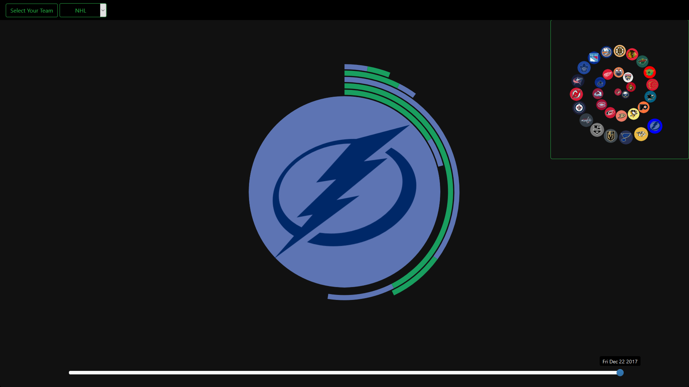
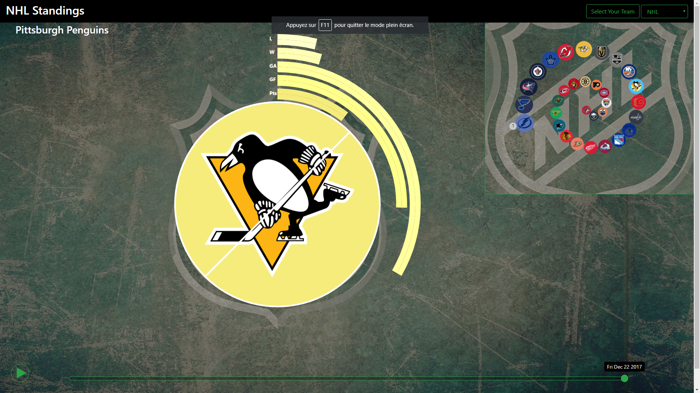

# Process Book

## Content

This process book contains 5 part:
* Original Project Proposal
* Evolution of the layout and sketches
* Evolution of the user interaction
* Interesting technical details
* Possible Improvements

## Project Propsoal

We want to build a visualization that overviews the current state of the NHL championship while giving the opportunity to the viewer to compare stats between two teams. We will include a time slider that let's the user interactively change the date to transform the data that is fed to the visualization.

For the overview, we will order and scale the logos of each team with respect to their current number of points in the league. We want to show the ordered logos following a certain shape, like a spiral or eventually a shape related to hockey.

To compare two team, the user will have to click on one logo, then that logo will be highlighted and when the user clicks on another logo, the two logo are superposed (one half in the right with one half on the left) and re-scaled, and circular barplots around the logos appear to compare their statistics.

### Motivation
It would be interesting to make a viz that can give a good picture of how the NHL is evolving while being interactive and giving the user more in depth comparison of his favorite team if he wants to.

### Target Audience
We target mostly NHL fans but no specific knowledge is required to understand the overview visualization. The comparison might require the viewer to know about hockey a bit.

### Related Work and Inspiration
We wanted to find a nice way to get a global picture of a championship and we found the NHL to be a good fit to try.

### What am I trying to show
The goal is really to show how the championship is evolving over time.

## Layout evolution and sketches

First we thought about having three separated parts of the page dedicated to display the data and the user choices.
One part was the overall state of the competition and the two other parts were to compare the selected team's statistics.

 

 

But we were not satisfied with this design so we decided to change for a "two sided" page where the user, by hovering on either the right or left side of the page, slides the window and can focus on the general ranking or the selected team's statistics. This gives us the possibility to show within a single page stats and ranking of the league.

 

 <figure>
  
  
</figure>

 

The next screenshot gives a look at what this layout looked like:

 

  

 

But as you can see the sliding window doesn't bring a lot of value to the visualization. You don't get much from the unselected panel.

We sketched a diffrent layout with a "wheel" to select and show the state of the championship while showing the detailed stats:

 

  

 

But we never implemented this layout as we found a different idea that holds the original wish of having a specific shape representing the state of the league.
We went for two rectangular frames (that can be interchanged) instead of a sliding windows such that the content in the frame can be observed wheter it is minized or not:

 

  

 

At this point we have a layout that fits our needs and it was a good time for a first beautify:

 

  

 

Of course a lot of the functionality is still missing at this point but the viz is already nicer to look at.

The next step was to actually implement the content of the right panel and see how it interacted with the whole visualization. Here is how the two panels were displayed at this point:

 

  

 

And in the next image you can see the other layout.

 

  

 

You might notice that the size of the top right panel is too small. This will be adressed later down the line!

After some thought and tests we decided to change the "bar plot sticking out of a circle" idea for a radial chart. It is visually more coherent. You can see the first prototype version of it in the next image:

 

  

 

Then we added labels and showed for each team, a bar for each stats such that we can effectively compare the stats. The stats shown are:
- W: wins
- L: losses
- GA: goal against the team
- GS: goal scored by the team
- P: Number of points of the team

 

  

 

We also considered a stacked bar version, but it is even harder to compare the bars that way:

 

  

 

When updating the data from the timeline, the spiral transits. The first version only moved all the circles in the center and looked like something from the next image:

 

  

 

But it turns out that in order to perceive the evolution of the league, it's primordial to see how the circles ordering changes. For that reason we implemented improved transition where each circles moves towards its new designated position:

 

  

 

At this point we did some small adjustement to improve the visual quality of the viz, like adding a better background and adjusting certain colors:

 

  

 

Thanks to feedback from the teacher, we realized that we were missing key indication to explain how the viz works to new users. We improved the understandability by adding small circles stating the rank of the team. We can also leverage this circle to show which teams are the first of the league with golden-silver-bronze colors!

 

  

 

But if you know about the NHL, you know that what matters most is to know which team goes to the play-off, therefore we decided to use the small circles to show which team gets to be in the next phase of the championship at the current time:

 

  

 

You also know directly if the team advanced because of its division ranking or if it is one of the two best team of each conference that were not qualified (wildcard).

After this we made the top right pannel bigger and we recentered the spiral. We also tried to linearly change the color of circular bars in order to better differentiate each stats but as expected, since a linear change of color is not perceived linearly by the human visual system, we feel like the result isn't too good.

 

  

 

## User interaction evolution

At first we went with a carousel selector with a pop-up to let the user select his favorite team.

 

 

But the selection of the team was too tedious and slow so we added a grid layout to select the team. Since there are 31 teams, we also added a random selector to have an nice even grid of 4 by 8.

 

 

We implemented a slider that let's the user easily change the date of the championship and
a dropdown to select either the conference or the division of the currently selected team as this an important feature of the NHL. This let's the user see a ranking of the team that actually play against each other in the league since the team only play against other teams in their conference.

 

 

By clicking on the top right panel, the user can switch between two display modes. This let's the user focus either on more detailled stats or on the general ranking.
The final version of the panel is blinking until the user clicks on hit once such that the user undertstands the purpose of the panel and how to interact with it. Here we show a screenshot of the panel in transition!

 

 

The user can also click on another team to select it and it will be highlighted in red. Also the circles react to mouse enter events to make spiral a bit more fluid and dynamic. Also the name of the team appears (we changed the text's position to the middle of the screen afterwards).

 

 

Finally we added a play button that let's the timeline change automatically letting the user follow the evolution of the championship in real time.

 

 

## Implementations details

### General:
General things to note are:
* We get data dynamically from the NHL league API so the visualization is always up to date.
* There is an asynchronous data flow using jquery
* We hosted the viz using github directly
* We try to use modern Javascript syntax
* We follow a "\<defs\> and \<pattern\>" architecture as much as possible.

We can't mention everything so we will highlight some interesting points in this part.

### Data Pipeline
There are a few method to consider for this part:
* loadNHLData() which does just that
* getCleanedTeams() that extract the relevant fields from the data loaded above
* reloadAndDraw() that can reload the data if the date was changed for example and then calls:
* draw() which draws the teams.

We propagate a boolean parameter "shouldTransit" because of the need to know if we should play our nice spiral transition when drawing the spiral or if each circle should be placed at its correct position directly.

We also use localStorage to store user choices for next session and when some information needs to be persistant.

### Drawing the spiral
The procedures to draw the spiral is the following:
* At init time, we build the necessary SVG elements using D3
* First step of drawing is to compute the center of each circles
  * Start from first circle (smallest)
  * Iteratively compute each point from the last one
* When all centers are known we can use these points to transition our SVG elements accordingly

The relevant functions are computeSpiralData() and drawSpiral().

### Drawing two halves of logos
The trick here is to use two D3 arcs with the correct angles to generate a correct path for both pattern.
We then compute the correct position for the image from the bounding box of the englobing element and the boundingbox of the path itself. That way we can perfectly align the logos:

 

 

### Drawing the circular bar chart
The circular bar chart is drawn using D3 Arcs, which are defined by an inner radius, an outer radius, a start angle and an end angle. By feeding numerical team data to the arcs and using a few computation functions to determine the radii and the angles on the fly, we are able to dynamically draw them based on the values of the data. 
The arcs are colored based on the team color, and distinguished by small color gradients to ease the visualization.

## Possible Improvements

Here are the top 6 things that we consider would be great improvements to our viz:
* During the spiral transition, suggest which pairs of team are playing (for example using lightning between each pairs that plays)
* We can include more details in the stats panel, there are many data points for each team in the data
* A way to see recent matches and future matches for a selected date
* Transition of the circular bar chart instead of removing and redrawing them each time
* A storyline to follow, marking cool events during the league (these could be automatically generated for the selected team)
* A bit of work on the choice of colors to make the whole viz more coherent
